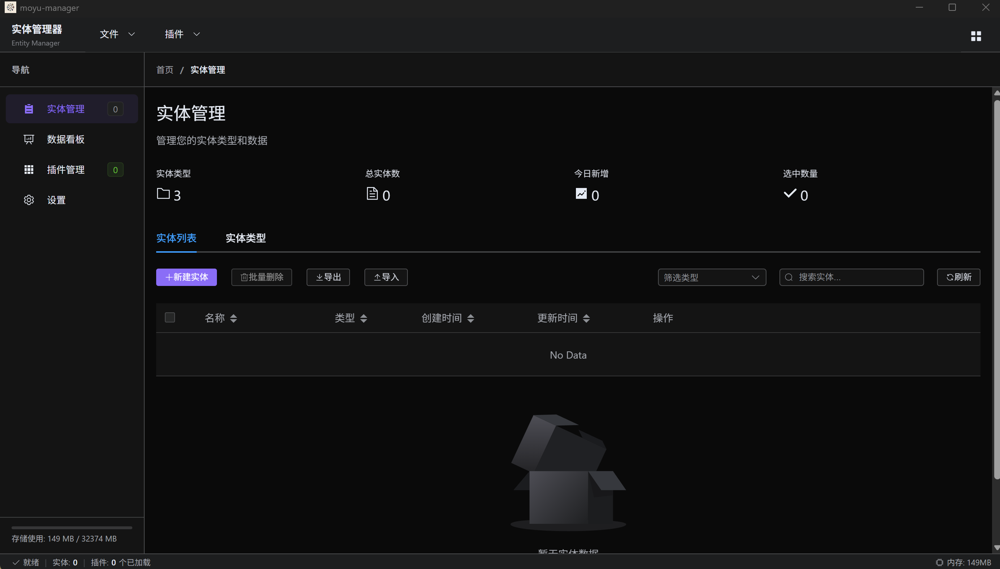
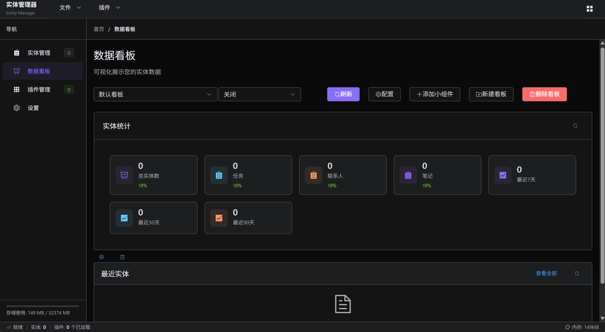
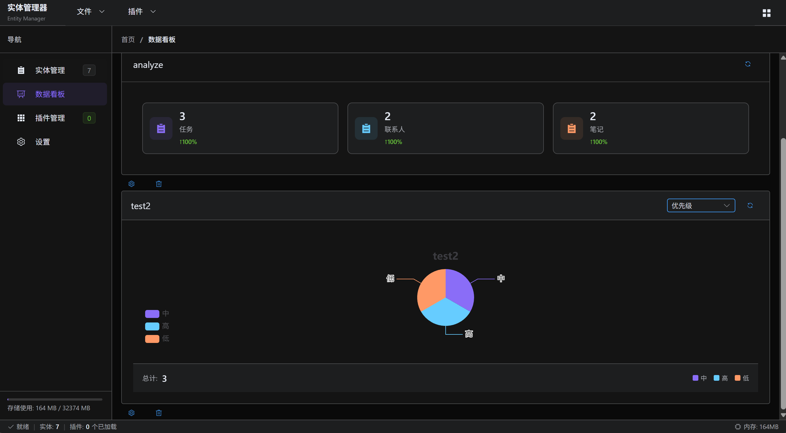
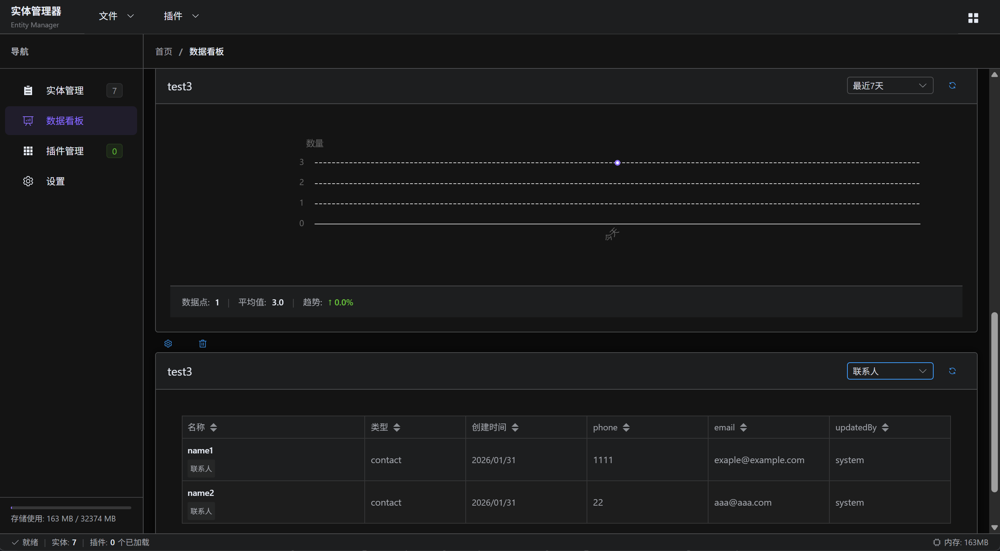

# Entity Manager - 实体管理桌面应用

<div align="center">

**Moyu Entity Manager**

[English](#english-version) | [中文](#中文版本)

</div>






## 中文

### 项目概述

Entity Manager 是一个基于 Electron、Vue 3 和 TypeScript 构建的现代化桌面应用程序，用于管理结构化实体数据。设计灵感来源于 VS Code 和 Obsidian，它提供了一个灵活、可扩展的平台，通过强大的插件系统来组织和分析各种类型的实体（任务、联系人、项目等）。

### 项目特色

- **灵活的实体管理**：创建具有可配置字段的自定义实体类型，支持完整的增删改查操作
- **高级插件系统**：通过类似 VS Code 扩展的安全沙盒插件扩展功能
- **数据看板系统**：使用 ECharts 集成创建可定制的数据可视化看板
- **自定义文件格式**：将完整的应用程序状态保存到 `.em` 文件中，便于备份和共享
- **现代化 UI/UX**：简洁专业界面，支持暗色/亮色主题和响应式设计
- **跨平台支持**：支持 Windows、macOS 和 Linux

### 技术栈

| 层级           | 技术                                 |
| -------------- | ------------------------------------ |
| **桌面框架**   | Electron（主进程/渲染进程架构）      |
| **前端框架**   | Vue 3 + TypeScript + Composition API |
| **UI组件库**   | ElementPlus + 自定义 SCSS 样式       |
| **构建工具**   | Vite + Electron Builder              |
| **数据可视化** | ECharts + Vue-ECharts                |
| **状态管理**   | Pinia                                |
| **路由管理**   | Vue Router                           |
| **配置管理**   | Electron Conf + 自定义配置服务       |

### 运行方式

#### 环境要求

- Node.js 18+ 和 npm/yarn/pnpm
- Git（用于开发）

#### 安装

```bash
# 克隆仓库
git clone <仓库地址>
cd entity-manager

# 安装依赖
npm install

# 启动开发服务器
npm run dev
```

#### 开发命令

```bash
# 开发模式
npm run dev

# 类型检查
npm run typecheck

# 代码检查
npm run lint

# 代码格式化
npm run format

# 特定平台构建
npm run build:win    # Windows
npm run build:mac    # macOS
npm run build:linux  # Linux
```

#### 项目结构

```
entity-manager/
├── src/
│   ├── main/              # Electron 主进程
│   │   ├── services/      # 核心服务（实体、插件、文件等）
│   │   └── index.ts       # 主进程入口
│   ├── renderer/          # Vue 前端
│   │   ├── components/    # Vue 组件
│   │   ├── views/         # 页面组件
│   │   ├── stores/        # Pinia 存储
│   │   └── router/        # Vue Router 配置
│   └── shared/            # 进程间共享代码
│       └── types/         # TypeScript 类型定义
├── plugins/               # 插件目录
│   ├── system/           # 系统插件
│   ├── user/             # 用户安装的插件
│   └── dev/              # 开发插件
├── test-plugin-source/   # 示例插件
├── test/                 # 测试文件
└── build/                # 构建配置
```

### 插件开发说明

Entity Manager 具有一个强大、安全的插件系统，允许开发者以类似 VS Code 扩展的方式扩展功能。

#### 插件架构

插件系统设计注重安全性和可扩展性：

- **沙盒执行**：插件在隔离的 Node.js vm 环境中运行
- **权限系统**：细粒度的 API 访问权限控制
- **事件系统**：订阅和发射应用程序事件
- **完整生命周期**：未加载 → 已加载 → 已初始化 → 激活 → 未激活 状态
- **插件上下文**：通过 `PluginContext` 提供受限的 API 访问

#### 创建插件

1. **创建插件结构**：

   ```bash
   mkdir -p plugins/dev/my-plugin
   cd plugins/dev/my-plugin
   ```

2. **创建 `plugin.json`**：

   ```json
   {
    "id": "my-plugin",
    "name": "我的插件",
    "version": "1.0.0",
    "description": "Entity Manager 示例插件",
    "homepage": "https://github.com/example/entity-manager",
    "repository": "https://github.com/example/entity-manager-plugins",
    "author": "您的名字",
    "permissions": ["entities:read", "config:read", "ui:show"],
    "commands": [
      {
        "id": "my-plugin.say-hello",
        "name": "打招呼",
        "description": "显示问候信息"
      }
    ]
   }
   ```

3. **创建 `index.js`**：

   ```javascript
   // 主插件模块
   async function activate(context) {
     console.log('我的插件正在激活...')

     // 访问实体数据
     const entities = await context.entities.getEntities()
     console.log(`找到 ${entities.length} 个实体`)

     // 订阅事件
     const eventSubscription = context.events.on('entity:created', (data) => {
       console.log('新实体创建：', data)
     })

     // 存储以供清理
     return { eventSubscription }
   }

   async function deactivate() {
     console.log('我的插件正在停用...')
     // 清理资源
   }

   module.exports = { activate, deactivate }
   ```

#### 插件 API 参考

| API 模块           | 描述     | 关键方法                                                              |
| ------------------ | -------- | --------------------------------------------------------------------- |
| `context.entities` | 实体管理 | `getEntities()`, `createEntity()`, `updateEntity()`, `deleteEntity()` |
| `context.files`    | 文件操作 | `read()`, `write()`, `list()`                                         |
| `context.config`   | 配置管理 | `get()`, `set()`, `delete()`                                          |
| `context.ui`       | 用户界面 | `showNotification()`, `showDialog()`, `createView()`                  |
| `context.storage`  | 插件存储 | `get()`, `set()`, `delete()`                                          |
| `context.logger`   | 日志记录 | `debug()`, `info()`, `warn()`, `error()`                              |
| `context.events`   | 事件系统 | `on()`, `off()`, `emit()`                                             |
| `context.utils`    | 工具函数 | `generateId()`, `formatDate()`, `sleep()`                             |

#### 示例插件

查看 `test-plugin-source/entity-stats-plugin/` 中的完整示例插件，演示了：

- 完整的生命周期管理
- 事件订阅
- 配置管理
- 命令注册
- 存储使用
- 最佳实践

#### 测试插件

```bash
# 运行插件测试
npx ts-node test/example-plugin-test/entity-stats-plugin.test.ts
```

### 核心服务

#### 实体服务

- 实体的增删改查操作
- 定义具有可配置字段的自定义实体类型
- 搜索和筛选功能
- 导入/导出功能

#### 文件服务

- `.em` 文件格式（包含 `data.json` 和 `meta.json` 的自定义压缩格式）
- 最近文件跟踪
- 自动保存功能
- 导出到多种格式（CSV、JSON）

#### 插件服务

- 插件发现和加载
- 生命周期管理
- 权限系统
- 事件系统集成
- 沙盒执行

#### 看板服务

- 可定制的看板布局
- 支持多种图表类型的小部件系统
- 模板系统
- 实时数据更新

#### 配置服务

- 应用程序范围配置
- 主题管理（暗色/亮色）
- 插件特定设置
- 配置导入/导出

### 文件格式

Entity Manager 使用自定义的 `.em` 文件格式，包含：

- `meta.json`：关于数据文件的元数据（版本、名称、实体类型等）
- `data.json`：实际的实体数据、设置和看板

示例结构：

```json
// meta.json
{
  "version": "1.0.0",
  "name": "项目数据",
  "created": 1640995200000,
  "entityTypes": [
    {
      "id": "task",
      "name": "任务",
      "customFields": [
        { "id": "priority", "name": "优先级", "type": "select", "options": ["高", "中", "低"] }
      ]
    }
  ]
}

// data.json
{
  "entities": [
    {
      "_type": "task",
      "_id": "task_001",
      "name": "设计数据库",
      "priority": "高",
      "createdAt": 1640995200000
    }
  ],
  "settings": {},
  "dashboards": []
}
```

### 开发指南

#### 代码风格

- 遵循 TypeScript 严格模式
- 使用 Composition API 和 `<script setup>` 语法
- 遵循 ElementPlus 组件模式
- 使用 SCSS 和 CSS 自定义属性进行样式设计

#### 架构模式

- 主进程处理所有业务逻辑
- 进程间使用 IPC 通信
- 不同领域使用服务（实体、插件、文件等）
- 事件驱动设计以提高可扩展性

#### 测试

- 服务的单元测试
- IPC 的集成测试
- 插件系统测试
- 关键路径的端到端测试

### 贡献指南

1. Fork 本仓库
2. 创建功能分支 (`git checkout -b feature/amazing-feature`)
3. 提交更改 (`git commit -m '添加新功能'`)
4. 推送到分支 (`git push origin feature/amazing-feature`)
5. 打开 Pull Request

### 许可证

本项目采用 MIT 许可证 - 详见 LICENSE 文件。

---

## English

### Project Overview

Entity Manager is a modern desktop application built with Electron, Vue 3, and TypeScript for managing structured entity data. Designed with inspiration from VS Code and Obsidian, it provides a flexible, extensible platform for organizing and analyzing various types of entities (tasks, contacts, projects, etc.) with a powerful plugin system.

### Key Features

- **Flexible Entity Management**: Create custom entity types with configurable fields and complete CRUD operations
- **Advanced Plugin System**: Extend functionality with secure, sandboxed plugins similar to VS Code extensions
- **Dashboard System**: Create customizable data visualization dashboards with ECharts integration
- **Custom File Format**: Save complete application state to `.em` files for easy backup and sharing
- **Modern UI/UX**: Clean, professional interface with dark/light theme support and responsive design
- **Cross-Platform**: Available for Windows, macOS, and Linux

### Technology Stack

| Layer                  | Technology                                    |
| ---------------------- | --------------------------------------------- |
| **Desktop Framework**  | Electron (Main/Renderer Process Architecture) |
| **Frontend Framework** | Vue 3 + TypeScript + Composition API          |
| **UI Components**      | ElementPlus + Custom SCSS Styling             |
| **Build Tools**        | Vite + Electron Builder                       |
| **Data Visualization** | ECharts + Vue-ECharts                         |
| **State Management**   | Pinia                                         |
| **Routing**            | Vue Router                                    |
| **Configuration**      | Electron Conf + Custom Config Service         |

### Getting Started

#### Prerequisites

- Node.js 18+ and npm/yarn/pnpm
- Git (for development)

#### Installation

```bash
# Clone the repository
git clone <repository-url>
cd entity-manager

# Install dependencies
npm install

# Start development server
npm run dev
```

#### Development Commands

```bash
# Development mode
npm run dev

# Type checking
npm run typecheck

# Linting
npm run lint

# Formatting
npm run format

# Build for specific platform
npm run build:win    # Windows
npm run build:mac    # macOS
npm run build:linux  # Linux
```

#### Project Structure

```
entity-manager/
├── src/
│   ├── main/              # Electron main process
│   │   ├── services/      # Core services (Entity, Plugin, File, etc.)
│   │   └── index.ts       # Main process entry
│   ├── renderer/          # Vue frontend
│   │   ├── components/    # Vue components
│   │   ├── views/         # Page components
│   │   ├── stores/        # Pinia stores
│   │   └── router/        # Vue Router configuration
│   └── shared/            # Shared code between processes
│       └── types/         # TypeScript type definitions
├── plugins/               # Plugin directories
│   ├── system/           # System plugins
│   ├── user/             # User-installed plugins
│   └── dev/              # Development plugins
├── test-plugin-source/   # Example plugins for development
├── test/                 # Test files
└── build/                # Build configuration
```

### Plugin Development

Entity Manager features a powerful, secure plugin system that allows developers to extend functionality similar to VS Code extensions.

#### Plugin Architecture

The plugin system is built with security and extensibility in mind:

- **Sandbox Execution**: Plugins run in isolated Node.js vm environments
- **Permission System**: Granular permission controls for API access
- **Event System**: Subscribe to and emit application events
- **Complete Lifecycle**: UNLOADED → LOADED → INITIALIZED → ACTIVE → INACTIVE states
- **Plugin Context**: Limited API access through `PluginContext`

#### Creating a Plugin

1. **Create Plugin Structure**:

   ```bash
   mkdir -p plugins/dev/my-plugin
   cd plugins/dev/my-plugin
   ```

2. **Create `plugin.json`**:

   ```json
   {
    "id": "my-plugin",
    "name": "My Plugin",
    "version": "1.0.0",
    "description": "A sample plugin for Entity Manager",
    "homepage": "https://github.com/example/entity-manager",
    "repository": "https://github.com/example/entity-manager-plugins",
    "author": "Your Name",
    "permissions": ["entities:read", "config:read", "ui:show"],
    "commands": [
      {
        "id": "my-plugin.say-hello",
        "name": "Say Hello",
        "description": "Display a hello message"
      }
    ]
   }
   ```

3. **Create `index.js`**:

   ```javascript
   // Main plugin module
   async function activate(context) {
     console.log('My plugin is activating...')

     // Access to entities
     const entities = await context.entities.getEntities()
     console.log(`Found ${entities.length} entities`)

     // Subscribe to events
     const eventSubscription = context.events.on('entity:created', (data) => {
       console.log('New entity created:', data)
     })

     // Store for cleanup
     return { eventSubscription }
   }

   async function deactivate(context) {
     console.log('My plugin is deactivating...')
     // Clean up resources
   }

   module.exports = { activate, deactivate }
   ```

#### Plugin API Reference

| API Module         | Description       | Key Methods                                                           |
| ------------------ | ----------------- | --------------------------------------------------------------------- |
| `context.entities` | Entity management | `getEntities()`, `createEntity()`, `updateEntity()`, `deleteEntity()` |
| `context.files`    | File operations   | `read()`, `write()`, `list()`                                         |
| `context.config`   | Configuration     | `get()`, `set()`, `delete()`                                          |
| `context.ui`       | User interface    | `showNotification()`, `showDialog()`, `createView()`                  |
| `context.storage`  | Plugin storage    | `get()`, `set()`, `delete()`                                          |
| `context.logger`   | Logging           | `debug()`, `info()`, `warn()`, `error()`                              |
| `context.events`   | Event system      | `on()`, `off()`, `emit()`                                             |
| `context.utils`    | Utilities         | `generateId()`, `formatDate()`, `sleep()`                             |

#### Example Plugin

Check out the complete example plugin in `test-plugin-source/entity-stats-plugin/` which demonstrates:

- Complete lifecycle management
- Event subscription
- Configuration management
- Command registration
- Storage usage
- Best practices

#### Testing Plugins

```bash
# Run plugin tests
npx ts-node test/example-plugin-test/entity-stats-plugin.test.ts
```

### Core Services

#### Entity Service

- Create, read, update, delete entities
- Define custom entity types with configurable fields
- Search and filter capabilities
- Import/export functionality

#### File Service

- `.em` file format (custom compressed format with `data.json` and `meta.json`)
- Recent files tracking
- Auto-save functionality
- Export to various formats (CSV, JSON)

#### Plugin Service

- Plugin discovery and loading
- Lifecycle management
- Permission system
- Event system integration
- Sandbox execution

#### Dashboard Service

- Customizable dashboard layouts
- Widget system with various chart types
- Template system
- Real-time data updates

#### Config Service

- Application-wide configuration
- Theme management (dark/light)
- Plugin-specific settings
- Configuration import/export

### File Format

Entity Manager uses a custom `.em` file format that contains:

- `meta.json`: Metadata about the data file (version, name, entity types, etc.)
- `data.json`: Actual entity data, settings, and dashboards

Example structure:

```json
// meta.json
{
  "version": "1.0.0",
  "name": "Project Data",
  "created": 1640995200000,
  "entityTypes": [
    {
      "id": "task",
      "name": "Task",
      "customFields": [
        { "id": "priority", "name": "Priority", "type": "select", "options": ["High", "Medium", "Low"] }
      ]
    }
  ]
}

// data.json
{
  "entities": [
    {
      "_type": "task",
      "_id": "task_001",
      "name": "Design Database",
      "priority": "High",
      "createdAt": 1640995200000
    }
  ],
  "settings": {},
  "dashboards": []
}
```

### Development Guidelines

#### Code Style

- Follow TypeScript strict mode
- Use Composition API with `<script setup>` syntax
- Follow ElementPlus component patterns
- Use SCSS for styling with CSS custom properties

#### Architecture Patterns

- Main process handles all business logic
- IPC for communication between processes
- Services for different domains (Entity, Plugin, File, etc.)
- Event-driven design for extensibility

#### Testing

- Unit tests for services
- Integration tests for IPC
- Plugin system tests
- End-to-end testing for critical paths

### Contributing

1. Fork the repository
2. Create a feature branch (`git checkout -b feature/amazing-feature`)
3. Commit changes (`git commit -m 'Add amazing feature'`)
4. Push to branch (`git push origin feature/amazing-feature`)
5. Open a Pull Request

### License

This project is licensed under the MIT License - see the LICENSE file for details.